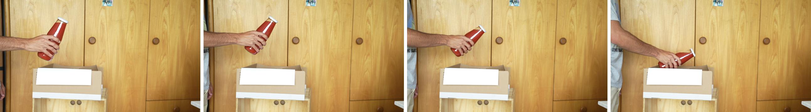

# Project Overview
For more details on my work, please refer to the main notebook. It provides a clearer explanation of my approach and goals. However, this README.md serves as an introduction to the project.

## Project Goal and Motivation
In this project, I tested several multimodal models like idefics2-8b, different versions of llava, and chatGPT-4o. However, I only included the code for chatGPT because running these models locally is difficult (or impossible, depending on the hardware). Additionally, I couldn't run all of them on Google Colab. Reloading these models and generating text was time-consuming, making it impractical for someone else to present the solution. 

So as you can see, one goal of me was, to just test out some of the newer models available:) 

**Project Purpose** 
The aim of this project was to identify the items and their quantities in a cardboard box based on images provided to the model. Here's an example image:

The image consists of multiple frames showing the object in motion. Determining the direction of the object's movement without any motion blur or other indicators is very difficult with just a single image, that's why a collage of images is provided. An amount of such images, referred to as imageSeries in the Python notebook, are processed sequentially. 

**Project Benefits and Relevance** 
This project is highly relevant to both everyday life and various business operations. In our daily routines, we often handle tasks that involve placing items into or removing items from containers, such as doing laundry, packing a backpack, or organizing documents. Similarly, businesses frequently deal with inventory management and item tracking.

By exploring this project, I aimed to determine if a model could effectively track the contents of my fridge. This would allow for automated shopping lists and meal plans based on available ingredients, and it would help in identifying items that are close to their expiration dates.

## Data Collection and Generation
The data for this project was generated synthetically. I recorded videos of myself placing objects into and removing them from a box, ensuring a high shutter speed to minimize motion blur. This made post-processing the video into a series of images easier. 

Initially, I took screenshots from the video and created collages using the Pillow library, but this was time-consuming. To streamline the process, I created a script called media.py. This script includes a function, extractFramesFromVideo(), which takes a video as input, specifies an output path, and determines how many frames to skip before extracting the next image. 
However, since many frames did not contain relevant actions, I integrated a hand recognition library. Now there were two conditions for the function to extract an image:  
1. enough frames are skipped. 
2. a hand is visible. 
This approach produced more reliable images.

I also included a function to automatically create image collages, or "imageSeries," and save them to a specified path. This function can also create reversed imageSeries, effectively doubling the amount of usable data. By moving selected images to the ImageSeriesToUse folder, I could loop through the desired image series efficiently. Although some manual tasks like deleting, selecting, moving, and renaming files remained, this method significantly reduced the overhead compared to creating imageSeries by hand. 

Since OpenAI only accepts images as URLs or base64 representations, the media.py script also handles the encoding of images.

## Modeling and Prompt Engineering

To gain an overview of the box's contents, I tried two types of prompts: 

1. A prompt that included a list of all items currently in the box, asking the model to identify the contents after processing a provided image.
2. A prompt where the model returned the object's name, quantity, and whether it was added to or removed from the box. This information allowed me to update the box's contents using a variable.

For the first approach, I dynamically added the current contents of the box to each prompt sent to OpenAI, starting from an empty box. I used the model's last response to update the box's contents. I created a Python class, cardboardBox.py, to represent and manipulate the box's information. This allowed me to specify how the model's answers should be structured and track the contents programmatically. This also ensured consistent data formatting even if the model's response varied. 

I also created llm.py to generate dynamic prompts and select the appropriate model: chatGPT-4o for prompts with images and 3.5-turbo otherwise. Functions in llm.py could enforce a JSON-structured response by passing an argument. For readability in the notebook, I mapped the two types of prompts to shorter string representations. 

For all models except chatGPT, only the second approach produced somewhat satisfactory results. For chatGPT, the first approach worked very well from the start. 

## Interpretation and Validation
For more details on the interpretation and validation process, please refer to the notebook. 
I was impressed with how accurately chatGPT identified the box's contents, as long as only one object changed per image. However, it struggled with labeling the objects correctly. Image resolution significantly impacted prediction accuracy; higher resolution images improved the results, while lower resolution images led to poorer predictions. 
The open-source models I tested often produced inaccurate ("hallucinated") results and struggled to interpret the imageSeries correctly, treating them as single images instead.
